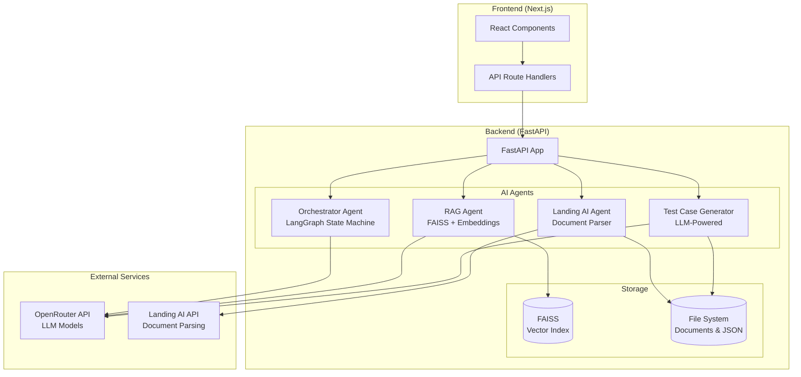
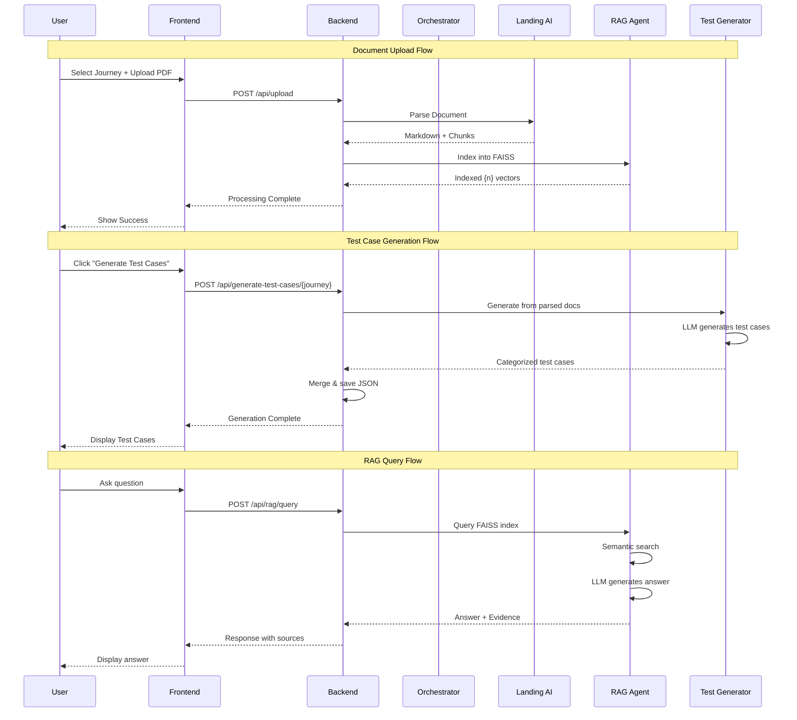

# TraceQA

> AI-powered QA Test Case Generator and Document Intelligence Platform

TraceQA is a full-stack application that transforms requirement documents into comprehensive test cases using AI. It features conversational document management, RAG-based question answering, and automated test case generation.


---

## 🎯 Features

- **📄 Document Upload & Parsing** - Upload PDFs and parse them using Landing AI's document extraction
- **🤖 Conversational Interface** - Chat-based workflow for managing journeys and documents  
- **🧪 AI Test Case Generation** - Automatically generate comprehensive test cases (Sanity, Regression, Positive, Negative, Edge cases)
- **💬 RAG Assistant** - Ask questions about your documents with source citations
- **📊 Test Case Management** - View, search, filter, and export test cases to Excel
- **📱 Responsive UI** - Works on desktop and mobile devices

---

## 🏗️ Architecture Overview



---

## 📂 Project Structure

```
TraceQA-272/
├── frontend/                    # Next.js 14 Frontend
│   ├── app/                     # App Router
│   │   ├── page.tsx            # Main page with layout
│   │   ├── layout.tsx          # Root layout
│   │   ├── globals.css         # Global styles
│   │   └── api/                # API route handlers (proxy to backend)
│   │       ├── chat/           # Chat endpoint
│   │       ├── upload/         # Document upload
│   │       ├── journeys/       # Journey management
│   │       ├── test-cases/     # Test case retrieval
│   │       ├── generate-test-cases/  # Test generation trigger
│   │       ├── rag/            # RAG query & stats
│   │       └── processing-status/    # Background job status
│   └── components/             # React components
│       ├── Sidebar.tsx         # Navigation sidebar
│       ├── Chatbot.tsx         # Chat assistant interface
│       ├── TestCasesView.tsx   # Test case management view
│       └── RAGAssistant.tsx    # RAG Q&A interface
│
├── backend/                     # FastAPI Backend
│   ├── main.py                 # FastAPI app entry point
│   ├── config.py               # Configuration & settings
│   ├── api/
│   │   └── chat.py             # All API endpoints
│   ├── agents/                 # AI Agent implementations
│   │   ├── orchestrator.py     # LangGraph conversation orchestrator
│   │   ├── landing_ai_agent.py # Document parsing agent
│   │   ├── rag_agent.py        # RAG with FAISS vector store
│   │   └── test_case_generator_agent.py  # Test case generation
│   └── requirements.txt        # Python dependencies
│
├── documents/                   # Document storage
│   └── journeys/               # Journey folders
│       └── {journey_name}/     # Each journey
│           ├── *.pdf           # Uploaded PDFs
│           ├── *_parse_result.json    # Parsed content
│           ├── *_test_cases.json      # Generated test cases
│           └── {journey}_merged_test_cases.json
│
└── ENV_VARIABLES.md            # Environment variable documentation
```

---

## 🔄 Application Flow



---

## 🚀 Quick Start

### Prerequisites

- **Node.js** >= 18.x
- **Python** >= 3.10
- **API Keys**: OpenRouter, Landing AI

### Backend Setup

```bash
# Navigate to backend
cd backend

# Create virtual environment
python -m venv venv
source venv/bin/activate  # Windows: venv\Scripts\activate

# Install dependencies
pip install -r requirements.txt

# Create environment file
cp .env.example .env
# Edit .env with your API keys (see Environment Variables section)

# Run the server
uvicorn main:app --reload --host 0.0.0.0 --port 8000
```

### Frontend Setup

```bash
# Navigate to frontend
cd frontend

# Install dependencies
npm install

# Create environment file (optional - defaults to localhost:8000)
echo "BACKEND_URL=http://127.0.0.1:8000" > .env.local

# Run development server
npm run dev
```

### Access the Application

- **Frontend (Local)**: http://localhost:3000
- **Frontend (Live)**: https://trace-qa-272-plut.vercel.app/
- **Backend API (Local)**: http://localhost:8000
- **Backend API (Swagger / Deployed)**: http://3.17.190.97:8000/docs
- **API Docs (ReDoc)**: http://localhost:8000/redoc

---

## 🔌 API Endpoints

| Endpoint | Method | Description |
|----------|--------|-------------|
| `/api/chat` | POST | Conversational chat with orchestrator |
| `/api/upload` | POST | Upload PDF document |
| `/api/journeys` | GET | List all journeys |
| `/api/test-cases/{journey}` | GET | Get test cases for journey |
| `/api/generate-test-cases/{journey}` | POST | Trigger test case generation |
| `/api/processing-status/{job_id}` | GET | Check background job status |
| `/api/rag/query` | POST | Query RAG system |
| `/api/rag/stats` | GET | Get vector index statistics |
| `/api/reset` | POST | Reset conversation session |

---

## 🧠 AI Agents

### 1. Orchestrator Agent (LangGraph)
- **Purpose**: Manages conversational workflow for document uploads
- **Flow**: Initial greeting → Option selection → Journey/Document type → Upload
- **Technology**: LangGraph StateGraph, LangChain Agent

### 2. Landing AI Agent
- **Purpose**: Parse PDFs into structured markdown and chunks
- **Capabilities**: Text extraction, table recognition, layout analysis
- **Output**: Markdown, chunks with metadata

### 3. RAG Agent
- **Purpose**: Answer questions using document content
- **Technology**: FAISS vector store, SentenceTransformers embeddings
- **Features**: Semantic search, source citations, confidence scores

### 4. Test Case Generator Agent
- **Purpose**: Generate comprehensive test cases from requirements
- **Categories**: Sanity, Regression, Positive, Negative, Edge cases
- **Output**: Structured JSON with steps, preconditions, expected results

---

## 🛠️ Tech Stack

### Frontend
| Technology | Version | Purpose |
|------------|---------|---------|
| Next.js | 14.2 | React framework with App Router |
| React | 18.3 | UI library |
| TypeScript | 5.x | Type safety |
| Tailwind CSS | 3.4 | Styling |
| xlsx | 0.18 | Excel export |

### Backend
| Technology | Version | Purpose |
|------------|---------|---------|
| FastAPI | 0.115 | Web framework |
| LangChain | 0.3.9 | LLM orchestration |
| LangGraph | 0.2.51 | Stateful agent workflows |
| FAISS | 1.9 | Vector similarity search |
| SentenceTransformers | 3.3 | Text embeddings |
| Landing AI SDK | 0.3.47 | Document parsing |

---

## 🔐 Environment Variables

### Backend (.env)

```env
# Required API Keys
OPENROUTER_API_KEY=your_openrouter_key
LANDINGAI_API_KEY=your_landing_ai_key

# Optional Configuration
OPENROUTER_BASE_URL=https://openrouter.ai/api/v1
DEFAULT_MODEL=nvidia/nemotron-nano-12b-v2-vl:free
LANDINGAI_BASE_URL=https://api.va.landing.ai/v1/ade
BACKEND_URL=http://localhost:8000
FRONTEND_URL=http://localhost:3000
```

### Frontend (.env.local)

```env
BACKEND_URL=http://127.0.0.1:8000
```

> See [ENV_VARIABLES.md](./ENV_VARIABLES.md) for detailed documentation.

---

## 📊 Test Case Categories

| Category | Description | Examples |
|----------|-------------|----------|
| **Sanity** | Basic smoke tests | Login works, page loads |
| **Regression** | Ensure existing features work | After update, old features intact |
| **Positive** | Valid input scenarios | Correct data accepted |
| **Negative** | Invalid input handling | Error messages for bad data |
| **Edge** | Boundary conditions | Max/min values, empty inputs |

---

## 📱 Screenshots

### Test Cases View
- Card and table view modes
- Search and filter functionality
- Export to Excel
- Generate test cases button

### RAG Assistant
- Journey-scoped Q&A
- Evidence with source citations
- Relevance scores

### Chat Assistant
- Guided document upload workflow
- Progress indicators
- Session management

---

## 🤝 Contributing

1. Fork the repository
2. Create a feature branch (`git checkout -b feature/amazing-feature`)
3. Commit changes (`git commit -m 'Add amazing feature'`)
4. Push to branch (`git push origin feature/amazing-feature`)
5. Open a Pull Request

---

## 📄 License

This project is proprietary software. All rights reserved.

---

## 🆘 Support

For issues or questions, please open a GitHub issue or contact the development team.
